# Zalo ↔ Telegram Bridge

[](https://github.com/winnie-sg/zalo-tg)
[](https://nodejs.org/)
[](https://www.typescriptlang.org/)
[](https://github.com/winnie-sg/zalo-tg/commits/main)

> A TypeScript bridge that mirrors Zalo direct messages and groups into Telegram forum topics, and sends replies from Telegram back to the correct Zalo conversation.

Tiếng Việt: [README.vi.md](README.vi.md)

## What this project does

`zalo-tg` keeps a Telegram supergroup with forum topics in sync with Zalo:

- each Zalo DM or group is mapped to one Telegram topic;
- inbound Zalo messages are forwarded into the matching topic;
- messages sent in a mapped Telegram topic are sent back to the matching Zalo DM or group;
- replies, reactions, recalls, albums, files, stickers, GIFs, voice messages, polls, group events and admin actions are tracked through local stores;
- login can use Zalo Web QR or the PC App API QR flow;
- optional Telegram Local Bot API mode lets large files and local file paths be handled more reliably.

The bridge is designed as a single Telegram bot/router with one active Zalo account. The current codebase is intentionally single-account: Zalo API state, credentials, topic mappings and caches are global.

## Requirements

- Node.js `>=20.11`
- npm
- Git (required for the curl installer and update flow)
- Optional: Go `>=1.24` to build the Charmbracelet TUI sidecar
- A Telegram bot token
- A Telegram supergroup with forum topics enabled
- The bot must be admin in that Telegram group
- A Zalo account that can scan QR login
- Optional: Docker / Docker Compose for the local Bot API setup

## Quick start

Recommended one-line installer:

macOS:

```bash
curl -fsSL https://raw.githubusercontent.com/williamcachamwri/zalo-tg/main/install.sh | sh
```

Linux:

```bash
curl -fsSL https://raw.githubusercontent.com/williamcachamwri/zalo-tg/main/install.sh | sh
```

Windows, through PowerShell plus Git Bash/WSL `sh`:

```powershell
curl.exe -fsSL https://raw.githubusercontent.com/williamcachamwri/zalo-tg/main/install.sh -o install.sh
sh install.sh
```

The curl installer clones or updates the project in `./zalo-tg` under your current terminal directory by default, then checks Node/npm/Go, installs npm dependencies, builds the Charmbracelet TUI sidecar when Go is available, and opens a polished `.env` setup wizard. It auto-runs default actions without waiting for yes/no confirmations; existing `.env` files are backed up before the wizard writes a fresh one.

To choose another install directory:

```bash
curl -fsSL https://raw.githubusercontent.com/williamcachamwri/zalo-tg/main/install.sh | ZALO_TG_INSTALL_DIR=/opt/zalo-tg sh
```

If you already cloned the repository:

```bash
sh install.sh
```

For unattended setup:

```bash
curl -fsSL https://raw.githubusercontent.com/williamcachamwri/zalo-tg/main/install.sh | sh -s -- --yes
```

Manual setup:

```bash
npm ci
cp .env.example .env # if your checkout contains one; otherwise create .env manually
npm run dev
```

Required `.env` keys:

```env
TG_TOKEN=123456:telegram-bot-token
TG_GROUP_ID=-1001234567890
```

Copy [.env.example](.env.example) for the full template. Complete configuration reference:

| Variable | Default / example | Used by | Purpose |
| --- | --- | --- | --- |
| `TG_TOKEN` | required | app | Telegram bot token from @BotFather. |
| `TG_GROUP_ID` | required, e.g. `-1001234567890` | app | Telegram supergroup/forum ID. Must be negative; bot must be admin and Topics must be enabled. |
| `DATA_DIR` | `./data` | app | Persistent store directory for topics, message maps, user cache, polls and auto-reply state. |
| `ZALO_CREDENTIALS_PATH` | `./credentials.json` | app | Zalo login credentials written after QR login. Keep private. |
| `ZALO_SKIP_MUTED_GROUPS` | `0` | app | `1` skips messages from muted Zalo groups entirely. |
| `ZALO_MUTE_SILENT` | `1` | app | `1` mirrors Zalo muted threads as silent Telegram messages; `0` always notifies. |
| `LOCAL_BOT_API` | `0` | app | `1` sends Telegram Bot API calls to `TG_LOCAL_SERVER`; `0` uses official `api.telegram.org`. |
| `TG_LOCAL_SERVER` | `http://127.0.0.1:8081` | app / Compose override | Local Bot API endpoint. Required only when `LOCAL_BOT_API=1`; Compose overrides it to `http://telegram-bot-api:8081`. |
| `TG_API_ID` | empty | Docker Compose | Telegram API ID for the `telegram-bot-api` container; get it from my.telegram.org. |
| `TG_API_HASH` | empty | Docker Compose | Telegram API hash for the `telegram-bot-api` container. |
| `TG_LOCAL_PORT` | `8081` | Docker Compose | Host port exposed by the local Bot API service. |
| `TGBOTAPI_DATA_DIR` | `./data/bot-api` | `start-local-api.sh` | Data/log directory for a locally installed `telegram-bot-api` binary. Docker Compose does not use this. |
| `ZALO_TG_SHARED_TMP_ROOT` | auto | app | Shared temp root for file paths that must be visible to both the bridge and local Bot API. Defaults to `/tmp` in local mode on POSIX, otherwise OS temp. |
| `ZALO_TG_RUNNER` | unset | app / Compose | Set to `1` only when an external supervisor restarts the process after update/restart exit codes. Do not set `0`; leave unset. |
| `NODE_ENV` | Docker sets `production` | Docker / Node | Runtime mode; normally managed by Docker. |
| `ZALO_TG_TUI` | enabled | app | `0` disables the live TUI/dashboard and prints normal logs. |
| `ZALO_TG_TUI_ENGINE` | auto | app | `ansi` forces the legacy TypeScript ANSI dashboard instead of the Go sidecar. |
| `ZALO_TG_TUI_MOUSE` | enabled | app | Use `0`, `false`, `off`, `no` or `native` to keep native terminal mouse selection. |
| `ZALO_TG_TUI_BIN` | auto-detect `bin/zalo-tg-tui` | app | Custom path to the Go TUI sidecar binary. |
| `ZALO_TG_GLOW_BIN` | auto-detect sibling `glow`, then `PATH` | Go TUI | Custom path to the Glow renderer used for the TUI help pane. |
| `ZALO_TG_TUI_DUMP_ON_EXIT` | enabled | app | `0` disables dumping the last TUI activity lines when the sidecar exits early. |
| `ZALO_TG_TUI_SIDECAR` | set internally | app / Go TUI | Internal marker added when Node spawns the Go sidecar. Do not set manually. |
| `ZALO_TG_NO_ANIMATION` | unset | app | `1` disables startup/shutdown terminal animations. |
| `NO_COLOR` | unset | app / terminal convention | Any value disables colored dashboard output. |
| `TERM` | terminal-provided | app / terminal convention | `TERM=dumb` disables the interactive dashboard. Usually do not set manually. |
| `ZALO_TG_INSTALL_DIR` | `./zalo-tg` under current terminal directory | installer only | Target checkout directory for `curl | sh`; export before running `install.sh` to override. |
| `ZALO_TG_REPO` | this GitHub repo | installer only | Repository URL used by `install.sh`; export before running the installer. |

After the bot starts, send `/login` in the Telegram group or in a private chat with the bot. Scan the QR code with Zalo. When login succeeds, the bridge starts listening and creates topics as conversations appear.

## Scripts

| Script | Purpose |
| --- | --- |
| `sh install.sh` | Interactive shell installer with a polished terminal UI; prepares dependencies, runs the full `.env` wizard, builds TypeScript and optional Go TUI sidecar. |
| `npm run dev` | Run the TypeScript app through `tsx`. |
| `npm run dev:watch` | Run with Node watch mode. |
| `npm run build` | Compile TypeScript into `dist/`. |
| `npm run tui:build` | Build the optional Charmbracelet TUI sidecar into `bin/zalo-tg-tui` and the bundled Glow renderer into `bin/glow`. |
| `npm start` | Run the compiled app. |
| `npm test` | Run all TypeScript tests. |
| `npm run check` | Build and run the full test suite. |
| `npm run test:coverage` | Run tests with Node coverage. |
| `npm run security:audit` | Run `npm audit --omit=dev`. |

## Main Telegram commands

| Command | Purpose |
| --- | --- |
| `/login` | Login to Zalo through QR. |
| `/loginweb` | Alias for the Web QR login flow. |
| `/loginapp` | Login through the PC App API QR flow. |
| `/search` | Search Zalo friends or groups and create/open topics. |
| `/addgroup` | Create topics for Zalo groups that do not have a topic yet. |
| `/group_info` | Show information for the mapped Zalo group in the current topic. |
| `/group_infoall` | Show the full group-member view when available. |
| `/history` | Load recent Zalo group history into the current topic. |
| `/addfriend` | Find and send a friend request by phone number. |
| `/friendrequests` | Review friend requests and group invitations. |
| `/joingroup` | Join a Zalo group from a link or invitation box. |
| `/leavegroup` | Leave the mapped Zalo group and close the topic. |
| `/topic` | List, inspect, delete or manage topic mappings. |
| `/autoreply` | Configure DM auto-reply behavior. |
| `/recall` | Recall a Zalo message by replying to the bridged Telegram message. |
| `/admin` | Diagnostics and cache/admin utilities. |
| `/status` | Show bridge health and mapping counts. |
| `/restart` | Request a supervised restart. |
| `/update` | Check for available project updates. |

## Codebase map

| Path | Role |
| --- | --- |
| `cmd/zalo-tg-tui/` | Optional Go TUI sidecar powered by Bubble Tea, Lip Gloss and Glow/Glamour Markdown rendering. |
| `src/index.ts` | Boots the process, starts Telegram polling, logs into Zalo, wires reconnect and shutdown. |
| `src/config.ts` | Reads environment variables and resolves paths. |
| `src/telegram/bot.ts` | Creates the Telegraf bot and synchronizes Telegram commands. |
| `src/telegram/handler.ts` | Owns Telegram commands, callbacks, message forwarding, reactions and poll answers. |
| `src/zalo/client.ts` | Owns the zca-js login/session singleton and Web QR login. |
| `src/zalo/loginApp.ts` | Implements the PC App API QR login flow and app-session persistence. |
| `src/zalo/handler.ts` | Handles Zalo listener events and forwards them to Telegram. |
| `src/zalo/appApi.ts` | Calls Zalo PC App endpoints used for group/member enrichment. |
| `src/zalo/autoReply.ts` | Sends optional auto-replies for eligible Zalo DMs. |
| `src/zalo/reaction.ts` | Maps Telegram reactions and Zalo reaction icons. |
| `src/store.ts` | Holds topic mappings, message mappings, caches, media buffers, reactions and poll stores. |
| `src/utils/media.ts` | Downloads, converts, probes and cleans media files. |
| `src/utils/format.ts` | Escapes, truncates and renders text/mentions/markup. |
| `src/utils/privateFile.ts` | Writes sensitive files with restricted permissions. |
| `src/utils/terminal.ts` | Live terminal/TUI status output. |
| `src/utils/tgQueue.ts` | Rate-limited Telegram call queue. |
| `src/lifecycle.ts` | Central shutdown/restart coordination. |
| `src/updater.ts` | Update-checking and update notification logic. |
| `tests/*.test.ts` | Unit and regression tests for stores, media, formatting, config and bridge edge cases. |

## Full codebase flow

The diagram below replaces the older Mermaid snippets and keeps the whole runtime logic in one place.

```mermaid
flowchart TD
  Start(["Process starts"]) --> Config["config.ts<br/>Load env, resolve DATA_DIR, Telegram, Zalo and Local Bot API settings"]
  Config --> Terminal["terminal.ts<br/>Install live console theme and startup status"]
  Terminal --> Stores["store.ts<br/>Load topics, msg-map, user cache, polls and in-memory buffers"]
  Stores --> TelegramSetup["telegram/bot.ts + telegram/handler.ts<br/>Create Telegraf bot, register commands, callbacks, message, reactions and polls"]
  TelegramSetup --> Updater["updater.ts<br/>Register update checker before callback catch-all"]
  Updater --> LaunchTG["tgBot.launch<br/>Allowed updates: message, callback_query, message_reaction, poll_answer, poll"]
  LaunchTG --> AutoLogin["zalo/client.ts:getZaloApi<br/>Read saved credentials and login with zca-js"]
  AutoLogin -->|credentials valid| StartZalo["index.ts:startZalo<br/>Attach Zalo listener, prune stale group topics, request catch-up on reconnect"]
  AutoLogin -->|missing or invalid| WaitLogin["Notify Telegram<br/>Ask operator to run /login, /loginweb or /loginapp"]
  WaitLogin --> LoginChoice{"Login command"}
  LoginChoice -->|/login or /loginweb| WebQR["zalo/client.ts:triggerQRLogin<br/>Generate QR, save image, send/print QR, save credentials"]
  LoginChoice -->|/loginapp| AppQR["zalo/loginApp.ts<br/>PC App QR, app-session.json, credentials.json, zpw_sek-capable session"]
  WebQR --> StartZalo
  AppQR --> StartZalo
  StartZalo --> Ready["Bridge ready<br/>Telegram polling + Zalo listener are both active"]

  Ready --> ZaloEvent{"Zalo listener event"}
  ZaloEvent -->|message| ZaloNormalize["zalo/handler.ts<br/>Normalize threadId, type, sender, quote, mute state and content"]
  ZaloNormalize --> AutoReplyCheck["zalo/autoReply.ts<br/>For eligible DMs, check auto-reply config and send guarded reply"]
  AutoReplyCheck --> SendZalo
  ZaloNormalize --> TopicLookup["store.getTopicByZalo<br/>Find or create Telegram forum topic for Zalo DM/group"]
  TopicLookup --> ZaloContent{"Zalo content type"}
  ZaloContent -->|text / link / card / location| ZaloText["format.ts<br/>Escape HTML, render mentions/markup, build Telegram text"]
  ZaloContent -->|photo album| ZaloAlbum["zaloAlbumStore<br/>Debounce by conversation + sender, dedupe URLs, keep fallback URLs"]
  ZaloContent -->|file / photo / video / gif| ZaloMedia["media.ts<br/>Download URL candidates, detect media type, prepare Telegram upload"]
  ZaloContent -->|sticker| ZaloSticker["Sticker handling<br/>Fetch detail, send static sticker/photo or convert sprite sheet to GIF"]
  ZaloContent -->|voice| ZaloVoice["Voice handling<br/>Download and send audio/voice-compatible payload"]
  ZaloContent -->|poll| ZaloPoll["pollStore<br/>Mirror Zalo poll to Telegram poll + score message"]
  ZaloContent -->|recall / undo| ZaloRecall["recentlyRecalledMsgIds + msgStore<br/>Suppress self recalls, notify Telegram for external recalls"]
  ZaloContent -->|reaction| ZaloReaction["reactionEventDedupeStore + reactionEchoStore + reactionSummaryStore<br/>Map target msg IDs, suppress echoes, aggregate Telegram summary"]
  ZaloContent -->|group/member event| ZaloGroupEvent["Group/member event handling<br/>Join requests, member updates, topic notices and group metadata refresh"]
  ZaloText --> SendTG["tgQueue / Telegram API<br/>Send message into mapped topic"]
  ZaloAlbum --> SendTG
  ZaloMedia --> SendTG
  ZaloSticker --> SendTG
  ZaloVoice --> SendTG
  ZaloPoll --> SendTG
  ZaloRecall --> SendTG
  ZaloReaction --> SendTG
  ZaloGroupEvent --> SendTG
  SendTG --> SaveInboundMap["msgStore.save / sentMsgStore reverse lookup<br/>Save Zalo msgId ↔ Telegram msgId and quote metadata"]
  SaveInboundMap --> Ready

  Ready --> TgUpdate{"Telegram update"}
  TgUpdate -->|command| CommandRouter["telegram/handler.ts command router<br/>Auth operator/admin, choose current topic, call Zalo API or stores"]
  CommandRouter --> CmdLogin["Login, search, topic, group info, history, friend requests, admin, status, update, restart"]
  CmdLogin --> CacheAndApi["friendsCache / groupsCache / aliasCache / userCache + zalo/appApi.ts<br/>Refresh search data, resolve mentions, enrich group info and fallback when PC App API is unavailable"]
  CacheAndApi --> Ready
  TgUpdate -->|callback_query| CallbackRouter["Callback router<br/>QR cancel, leave group confirm, friend request action, group request action, update action"]
  CallbackRouter --> Ready
  TgUpdate -->|message_reaction| TgReaction["TG reaction handler<br/>Dedupe update, map Telegram emoji to Zalo icon, lookup msgStore/sentMsgStore target"]
  TgReaction --> ZaloAddReaction["currentApi.addReaction / undo<br/>Mark reactionEchoStore before sending"]
  ZaloAddReaction --> Ready
  TgUpdate -->|poll_answer or poll| TgPollAnswer["Poll answer handler<br/>Find pollStore entry, lock/score mirrored poll when needed"]
  TgPollAnswer --> Ready
  TgUpdate -->|topic message| TopicMessage["TG→Zalo message handler<br/>Ignore bots/non-bridge chats, require message_thread_id"]
  TopicMessage --> TopicToZalo["store.getEntryByTopic<br/>Resolve Zalo conversation and thread type"]
  TopicToZalo --> TgContent{"Telegram content type"}
  TgContent -->|text / caption| TgText["Resolve reply quote, mentions, aliases and group scoped names<br/>sendMessage text"]
  TgContent -->|photo album| TgAlbum["mediaGroupStore<br/>Debounce Telegram media group, send Zalo image layout when possible"]
  TgContent -->|document / photo / animation / video| TgFile["downloadToTemp<br/>Use Local Bot API file path or HTTP download, upload/send attachment"]
  TgContent -->|voice / audio| TgVoice["convertToM4a + uploadAttachment + sendVoice/sendMessage fallback"]
  TgContent -->|sticker static| TgStaticSticker["convertStickerToPng<br/>Render Telegram WebP sticker to transparent PNG and send as image"]
  TgContent -->|sticker animated TGS| TgTgsSticker["convertTgsToGif<br/>Render Lottie frames to GIF and send as image/GIF"]
  TgContent -->|sticker video WebM| TgWebmSticker["convertWebmToGif<br/>Convert WebM sticker to GIF and send as image/GIF"]
  TgContent -->|location / contact| TgSimplePayload["Format as text and send to Zalo"]
  TgContent -->|Telegram poll| TgPollCreate["Create Zalo poll where supported, mirror Telegram poll state into pollStore"]
  TgText --> SendZalo["currentApi.sendMessage / sendVoice / uploadAttachment / addReaction"]
  TgAlbum --> SendZalo
  TgFile --> SendZalo
  TgVoice --> SendZalo
  TgStaticSticker --> SendZalo
  TgTgsSticker --> SendZalo
  TgWebmSticker --> SendZalo
  TgSimplePayload --> SendZalo
  TgPollCreate --> SendZalo
  SendZalo --> EchoGuard["sentMsgStore.markSending/unmarkSending<br/>Suppress self echo race from Zalo listener"]
  EchoGuard --> SaveOutboundMap["sentMsgStore.save + msgStore.save/updateQuoteFromEcho<br/>Keep future replies, recalls and reactions mapped"]
  SaveOutboundMap --> Ready

  Ready --> Reconnect{"Zalo disconnected"}
  Reconnect -->|manual| ManualStop["Do not reconnect"]
  Reconnect -->|duplicate or kicked| LoginRequired["Notify Telegram that login is required"]
  Reconnect -->|recoverable| ReconnectTimer["Wait 5 seconds, reset API, login from saved credentials, restart listener"]
  ReconnectTimer --> StartZalo

  Ready --> Shutdown{"Shutdown or restart requested"}
  Shutdown --> StopListeners["lifecycle.ts<br/>Stop Zalo listener and Telegram bot"]
  StopListeners --> FlushStores["Wait for debounced store persistence<br/>msg-map, user-cache, polls"]
  FlushStores --> Exit(["Process exits with requested code"])
```



## Data and persistence

| Data | Default location | Purpose |
| --- | --- | --- |
| Zalo credentials | `credentials.json` | zca-js login cookies, IMEI and user agent. |
| PC App session | next to credentials as `app-session.json` | Session material used by the PC App API helper. |
| Topic mappings | `data/topics.json` | Telegram topic ↔ Zalo conversation mapping. |
| Message mappings | `data/msg-map.json` or gzip payload | Zalo message IDs ↔ Telegram message IDs and quote metadata. |
| User cache | `data/user-cache.json.gz` | Zalo UID/name/alias/group-scoped member-name lookup. |
| Poll cache | `data/polls.json.gz` | Mirrored Zalo/Telegram poll mapping. |
| Temporary media | OS temp directory | Downloaded or converted files before upload. |
| QR image | `/tmp/zalo-tg/zalo-qr.png` in Local Bot API mode, otherwise OS temp | QR image sent to Telegram and printed in the terminal. |

Credentials and session files are sensitive. Do not commit them.

## Media behavior

The media pipeline is intentionally defensive because Zalo and Telegram expose files in different ways:

- Telegram Local Bot API paths are copied into bridge-owned temporary files.
- HTTP media downloads retry and can fall back across URL candidates.
- Zalo photo albums are debounced, deduplicated and sent as Telegram media groups where possible.
- Telegram photo albums are debounced and sent to Zalo as native image layouts when possible.
- Telegram static stickers are rendered as transparent PNG images for Zalo.
- Telegram TGS stickers are rendered frame-by-frame into GIF.
- Telegram WebM video stickers are converted into GIF.
- Zalo animated sticker sprite sheets are converted into GIF.
- Voice/audio payloads are converted to an uploadable format when needed.
- Temporary files are cleaned after upload attempts.

## Terminal UI

The default live dashboard is now Charmbracelet-aware:

- if `bin/zalo-tg-tui` exists and stdout is an interactive terminal, the Node bridge starts the Go sidecar automatically;
- the sidecar uses Bubble Tea for the event loop, keymaps and mouse handling; Bubbles for viewports, help, spinner and scroll progress; Lip Gloss for layout/style; Charmbracelet `x/ansi` for OSC52 clipboard copy; and the bundled Glow binary to render Markdown help, with Glamour fallback;
- if the binary is missing, the terminal is non-interactive, or `ZALO_TG_TUI=0` is set, the bridge falls back to the built-in ANSI dashboard/log output;
- set `ZALO_TG_TUI_ENGINE=ansi` to force the legacy TypeScript dashboard even when the Go sidecar exists;
- default mouse mode supports both wheel scrolling and OpenCode-style app-level row selection/copy in the activity pane;
- set `ZALO_TG_TUI_MOUSE=0` to keep native terminal mouse selection/scrolling, similar to OpenCode's `mouse: false` behavior. Keyboard scrolling still works inside the TUI;
- set `ZALO_TG_TUI_BIN=/absolute/path/to/zalo-tg-tui` to use a custom sidecar path.

Build the sidecar locally with:

```bash
npm run tui:build
```

Useful keys:

| Key | Action |
| --- | --- |
| `↑` / `↓` or mouse wheel | Scroll the focused pane. Mouse wheel requires mouse capture, enabled by default. |
| `PgUp` / `PgDn` | Page the focused pane. |
| `g` / `G` | Jump to oldest/live activity. |
| Drag in activity | Select visible activity rows while mouse wheel scrolling stays enabled; release auto-copies to clipboard. |
| `y` / `Ctrl+Y` | Copy the current activity selection using local clipboard tools when available, with OSC52 fallback for compatible terminals. |
| `Esc` | Clear the current activity selection. |
| `s` | Native-select fallback when mouse capture is enabled: the frame freezes and terminal selection works. Press `s` again to resume live updates. |
| `?` or `h` | Toggle the Glow-rendered help pane. |
| `Tab` | Move focus between activity and help panes. |
| `F1` | Expand/collapse the footer keymap. |
| `Ctrl+C` | Copy selected activity rows; when nothing is selected, stop the bridge. |

The Docker image builds and includes both the sidecar and bundled Glow renderer automatically.

## Reactions, replies and recalls

The bridge keeps enough metadata to make conversations feel native on both sides:

- `msgStore` maps Zalo message IDs to Telegram message IDs and stores Zalo quote payloads.
- `sentMsgStore` tracks Telegram-originated messages sent to Zalo.
- `reactionEchoStore` suppresses reaction echoes caused by the bridge itself.
- `reactionEventDedupeStore` prevents duplicate reaction updates after reconnects.
- `reactionSummaryStore` aggregates Zalo reactions into readable Telegram summaries.
- `recentlyRecalledMsgIds` suppresses duplicate recall notifications for recalls initiated from Telegram.

## Operational notes

- Keep the Telegram bot as an admin in the bridge group.
- Keep forum topics enabled in the Telegram group.
- Run `npm run check` before pushing changes.
- If media uploads fail in Local Bot API mode, make sure the Bot API server and the bridge can see the same absolute temporary paths.
- If Zalo reports duplicate/kicked sessions, close other Zalo Web/PC sessions and login again.
- If group member APIs fail with `zpw_sek`, the bridge falls back to the Web API where possible, but hidden-member groups may remain limited.

## Development checklist

```bash
npm run build
npm test
npm run check
```

The test suite covers formatting, config validation, stores, media conversion/download helpers, reaction mapping, queue behavior and regressions around Zalo/Telegram edge cases.
